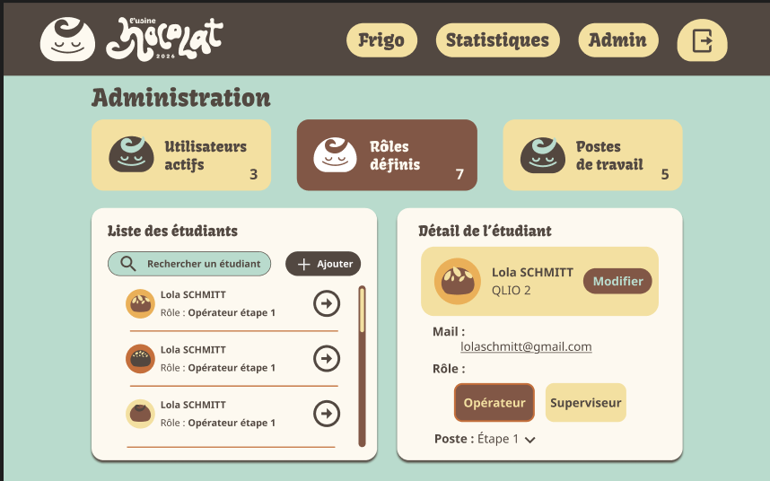
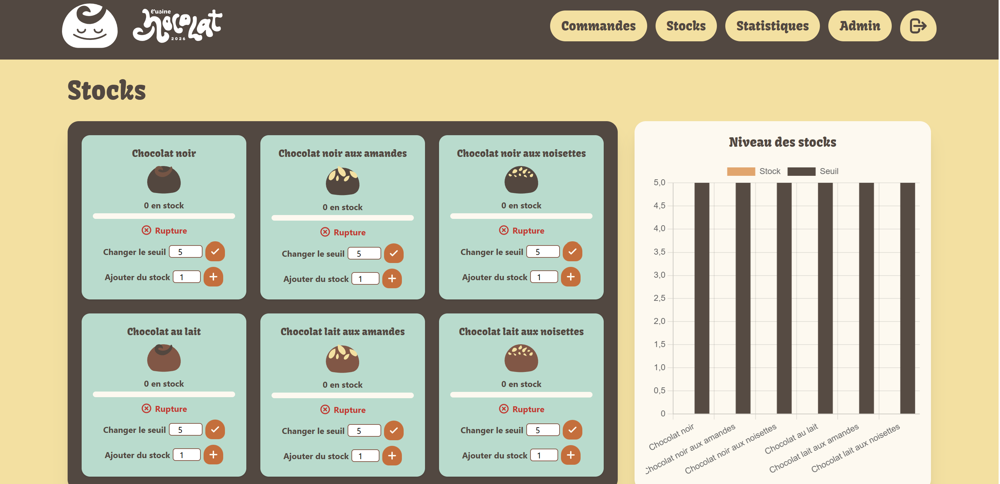

# Usine Chocolat - 2026

## Description
Ce projet a été réalisé en binôme pendant **1 mois** avec comme client l'usine à chocolat de la filière QLIO. L’objectif était de créer une application web pour **gérer** une mini-usine de chocolat, en suivant la **transformation des chocolats étape par étape**, en affichant des **statistiques** de conformité et en surveillant le **stock de chocolat** dans les frigos. Le site permet aussi de bloquer les machines en cas de panne et d’assurer la **sécurité** du système tout en respectant les standards **d’accessibilité**.

Une partie du site est destinée aux clients de l’usine : elle est accessible sur mobile et propose un petit accueil présentant l’usine, un formulaire de commande, ainsi qu’un récapitulatif après validation. L’ensemble du projet a été pensé pour être à la fois **fonctionnel et ergonomique**, tout en respectant les contraintes techniques et les besoins du client.

## Mon rôle
Avec ma binôme, nous avons pris en charge toutes les étapes du projet :  
- Analyse des besoins et rédaction du cahier des charges  
- Définition des personas, des user flows et des user stories  
- Conception des wireframes et des maquettes interactives  

Nous avons développé l’intégralité du site, front-end et back-end. La base de données a été d’abord conçue sur DrawSQL puis mise en place sur PHPMyAdmin. Le développement de l’application a été réalisé avec **Laravel** et **TailwindCSS**, et des interactions dynamiques ont été ajoutées grâce à **JavaScript** (Alpine.js). L’hébergement a été assuré via Plesk fourni par l’IUT.

## Technologies utilisées
- **Backend :** Laravel, PHP  
- **Frontend :** TailwindCSS, JavaScript  
- **Base de données :** MySQL  
- **Hébergement :** Plesk  

## Images du projet
Voici quelques images représentatives du projet :  

### Pages visiteurs

  
  

### Autres pages ( opérateur / superviseur )

  
  
  

## Résultat
Le site a été validé par le client et choisi pour la gestion de l’usine à chocolat lors de la JPO. La coordination en binôme a été réussie et le site est fonctionnel et agréable à utiliser. Des améliorations sont encore possibles, comme l’ajout d’un système de scan QR code pour les commandes.

## Retour d’expérience
Ce projet m’a permis de consolider mes compétences en gestion complète d’un projet web : de l’analyse des besoins au développement final, en passant par la conception UX/UI et la mise en place de la base de données. Il m’a également appris à livrer un projet complet et fonctionnel dans un délai court.
